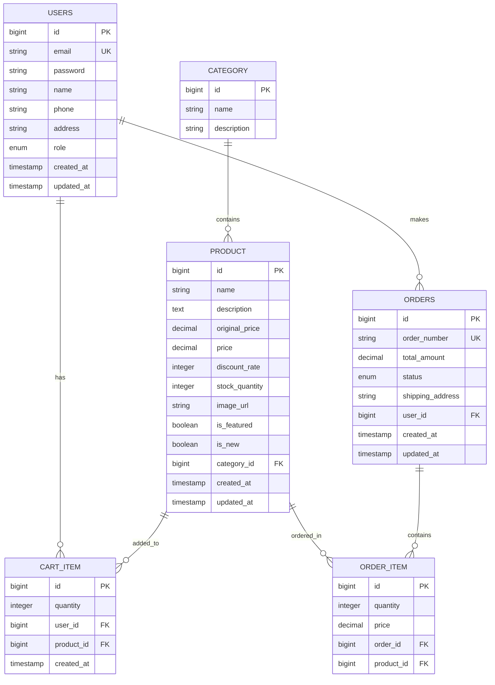

# 🛒 E-Commerce 쇼핑몰 프로젝트

Spring Boot + React로 구현한 **풀스택 쇼핑몰 시스템**입니다. 실무에서 사용하는 주요 기능들을 모두 포함한 완전한 이커머스 플랫폼입니다.

## 🚀 프로젝트 개요

### 주요 기능
- ✅ **인증/인가**: JWT 기반 로그인/회원가입 시스템
- ✅ **상품 관리**: CRUD, 검색, 필터링, 페이징, 할인율 관리
- ✅ **카테고리 관리**: 상품 카테고리 분류 시스템
- ✅ **장바구니**: 실시간 장바구니 관리 (추가/수정/삭제)
- ✅ **주문 시스템**: 주문 생성/조회/취소, 재고 관리
- ✅ **관리자 기능**: 상품/카테고리/주문 관리 대시보드
- ✅ **할인 시스템**: 원가/할인가 기반 동적 할인율 계산
- ✅ **상품 분류**: 인기상품/신상품 태깅 시스템
- ✅ **반응형 UI**: 모바일 친화적 디자인

### 기술 스택

#### 백엔드
- **Framework**: Spring Boot 3.2
- **Security**: Spring Security + JWT
- **Database**: H2 (개발용), MySQL (운영용)
- **ORM**: Spring Data JPA + Hibernate
- **Build Tool**: Maven
- **Java Version**: 17

#### 프론트엔드
- **Framework**: React 18
- **Build Tool**: Vite
- **Styling**: Tailwind CSS v4
- **Routing**: React Router DOM
- **HTTP Client**: Fetch API

## 📁 프로젝트 구조

```
├── backend/
│   └── src/main/java/com/shop/
│       ├── config/          # 설정 클래스 (Security, CORS 등)
│       ├── controller/      # REST API 컨트롤러
│       ├── dto/            # 데이터 전송 객체
│       ├── entity/         # JPA 엔티티
│       ├── exception/      # 예외 처리
│       ├── repository/     # 데이터 접근 계층
│       ├── security/       # JWT, 보안 관련
│       └── service/        # 비즈니스 로직
│
└── frontend/
    └── src/
        ├── components/     # 재사용 컴포넌트
        ├── pages/         # 페이지 컴포넌트
        ├── services/      # API 서비스
        └── utils/         # 유틸리티 함수
```

## 🔧 설정 및 실행

### 1. 프로젝트 클론
```bash
git clone <repository-url>
cd etc
```

### 2. 백엔드 실행
```bash
# 프로젝트 루트에서
mvn spring-boot:run
```

### 3. 프론트엔드 실행
```bash
cd frontend
npm install
npm run dev
```

### 4. 접속 정보
- **프론트엔드**: http://localhost:5173
- **백엔드 API**: http://localhost:8080
- **H2 데이터베이스**: http://localhost:8080/h2-console
  - JDBC URL: `jdbc:h2:mem:testdb`
  - Username: `sa`
  - Password: (비어있음)

## 🔐 테스트 계정

### 관리자 계정
- **이메일**: `admin@shop.com`
- **비밀번호**: `admin123`

### 일반 사용자 계정
- **이메일**: `user@shop.com`
- **비밀번호**: `user123`

## 📊 데이터베이스 설계 (ERD)



## 📚 API 명세서

### 🔐 인증 API
| Method | Endpoint | Description | Auth Required |
|--------|----------|-------------|---------------|
| POST | `/api/auth/signup` | 회원가입 | ❌ |
| POST | `/api/auth/login` | 로그인 | ❌ |

### 👤 사용자 API
| Method | Endpoint | Description | Auth Required |
|--------|----------|-------------|---------------|
| GET | `/api/users/profile` | 프로필 조회 | ✅ |
| PUT | `/api/users/profile` | 프로필 수정 | ✅ |

### 📦 상품 API
| Method | Endpoint | Description | Auth Required |
|--------|----------|-------------|---------------|
| GET | `/api/products` | 상품 목록 조회 (페이징, 검색, 필터링) | ❌ |
| GET | `/api/products/{id}` | 상품 상세 조회 | ❌ |
| GET | `/api/products/category/{categoryId}` | 카테고리별 상품 조회 | ❌ |
| GET | `/api/products/featured` | 인기상품 목록 | ❌ |
| GET | `/api/products/new` | 신상품 목록 | ❌ |
| GET | `/api/products/featured/home` | 홈페이지용 인기상품 (제한) | ❌ |
| GET | `/api/products/new/home` | 홈페이지용 신상품 (제한) | ❌ |
| POST | `/api/products` | 상품 등록 | ✅ (관리자) |
| PUT | `/api/products/{id}` | 상품 수정 | ✅ (관리자) |
| DELETE | `/api/products/{id}` | 상품 삭제 | ✅ (관리자) |

### 🏷️ 카테고리 API
| Method | Endpoint | Description | Auth Required |
|--------|----------|-------------|---------------|
| GET | `/api/categories` | 카테고리 목록 | ❌ |
| GET | `/api/categories/{id}` | 카테고리 상세 | ❌ |
| POST | `/api/categories` | 카테고리 생성 | ✅ (관리자) |
| PUT | `/api/categories/{id}` | 카테고리 수정 | ✅ (관리자) |
| DELETE | `/api/categories/{id}` | 카테고리 삭제 | ✅ (관리자) |

### 🛒 장바구니 API
| Method | Endpoint | Description | Auth Required |
|--------|----------|-------------|---------------|
| GET | `/api/cart` | 장바구니 조회 | ✅ |
| POST | `/api/cart` | 장바구니 추가 | ✅ |
| PUT | `/api/cart/{id}` | 수량 변경 | ✅ |
| DELETE | `/api/cart/{id}` | 상품 제거 | ✅ |
| DELETE | `/api/cart` | 장바구니 비우기 | ✅ |
| GET | `/api/cart/total` | 총 금액 조회 | ✅ |
| GET | `/api/cart/count` | 상품 개수 조회 | ✅ |

### 📋 주문 API
| Method | Endpoint | Description | Auth Required |
|--------|----------|-------------|---------------|
| GET | `/api/orders` | 내 주문 목록 | ✅ |
| POST | `/api/orders` | 주문 생성 | ✅ |
| GET | `/api/orders/{id}` | 주문 상세 | ✅ |
| GET | `/api/orders/number/{orderNumber}` | 주문번호로 조회 | ✅ |
| PUT | `/api/orders/{id}/cancel` | 주문 취소 | ✅ |
| GET | `/api/orders/admin/all` | 전체 주문 목록 | ✅ (관리자) |
| GET | `/api/orders/admin/status/{status}` | 상태별 주문 조회 | ✅ (관리자) |
| PUT | `/api/orders/admin/{id}/status` | 주문 상태 변경 | ✅ (관리자) |

## 🎨 주요 페이지

### 일반 사용자
- **홈페이지**: 인기상품/신상품 슬라이더
- **상품 목록**: 검색, 카테고리 필터링, 페이징
- **상품 상세**: 상품 정보, 장바구니 담기
- **장바구니**: 수량 조절, 총액 계산
- **주문 내역**: 주문 조회, 상태 확인

### 관리자
- **상품 관리**: 상품 CRUD, 할인율 설정
- **카테고리 관리**: 카테고리 CRUD
- **주문 관리**: 주문 상태 변경, 전체 주문 조회

## 💡 핵심 기능 설명

### 할인 시스템
- **원가격**: 상품의 정가
- **할인가격**: 실제 판매 가격
- **할인율**: `((원가격 - 할인가격) / 원가격) * 100` 자동 계산
- **동적 표시**: 할인이 있는 상품만 할인율 뱃지 표시

### 인증/보안
- **JWT 토큰**: 무상태 인증 방식
- **역할 기반 접근 제어**: USER/ADMIN 권한 분리
- **토큰 만료**: 24시간 자동 만료
- **CORS 설정**: 프론트엔드와의 원활한 통신

### 실시간 기능
- **장바구니 카운트**: 헤더에 실시간 표시
- **재고 관리**: 주문 시 자동 차감
- **상품 검색**: 실시간 검색 (최소 2글자)

## 🚀 배포 및 확장

### 운영 환경 설정
```yaml
# application-prod.yml
spring:
  datasource:
    url: jdbc:mysql://localhost:3306/shopping_mall
    username: ${DB_USERNAME}
    password: ${DB_PASSWORD}
  jpa:
    hibernate:
      ddl-auto: validate
    show-sql: false
```

### Docker 배포
```dockerfile
# Dockerfile
FROM openjdk:17-jdk-slim
COPY target/shopping-mall-*.jar app.jar
EXPOSE 8080
ENTRYPOINT ["java", "-jar", "/app.jar"]
```

## 🛠️ 향후 개발 계획

- 📱 **파일 업로드**: 상품 이미지 업로드
- 💳 **결제 연동**: 토스페이먼츠, 아임포트
- 📧 **이메일 알림**: 주문 확인, 배송 알림
- 🔍 **고급 검색**: Elasticsearch 연동
- 📊 **분석 대시보드**: 매출, 상품 통계
- 🧪 **테스트 코드**: 단위/통합 테스트 확충

## 📞 문의

프로젝트에 대한 문의사항이나 개선사항이 있으시면 언제든 연락주세요! 🙂

---

⭐ **이 프로젝트가 도움이 되셨다면 Star를 눌러주세요!** 